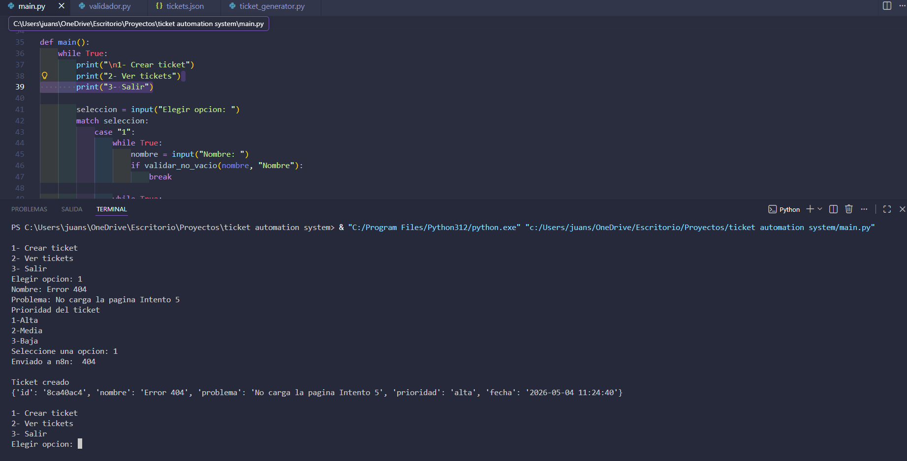
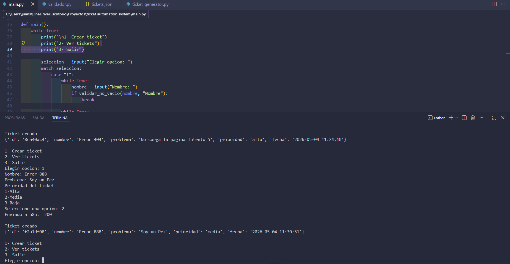
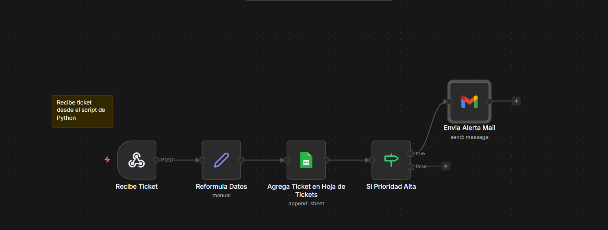
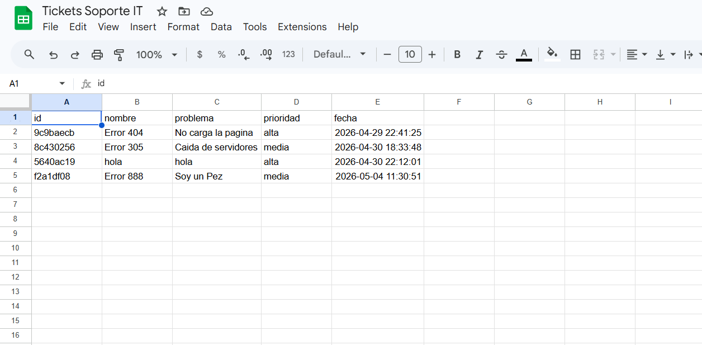

# Sistema de Automatización de Tickets IT

## 📌 Descripción
Sistema de gestión de incidencias que permite registrar, organizar y automatizar tickets de soporte técnico.
En el sistema se pueden crear tickets y ver la lista de tickets ya creados.
Los tickets se generan con un id unico, nombre de problema, descripcion del problema, prioridad y fecha y hora.
Una vez creados los tickets se guardan en un archivo.json y ademas el sistema esta conectado a un workflow n8n que guarda los tickets en un GoogleSheets.
En el caso de los tickets de prioridad alta, el workflow ademas envia un mail para notificar la creacion del ticket de prioridad alta.

## ⚙️ Tecnologías
- Python
- JSON
- n8n (automatización de workflows)
- Requests (HTTP)
- Google Sheets
- Gmail

## 🚀 Funcionalidades
- Creación de tickets desde consola
- Generación automática de ID único
- Registro local en archivo JSON
- Visualización de tickets creados
- Envío automático de datos mediante webhook
- Almacenamiento en Google Sheets
- Notificación automática por email para tickets de alta prioridad

## 🔄 Flujo del sistema
1. El usuario crea un ticket desde Python
2. El ticket se guarda localmente en un archivo JSON
3. Se envía automáticamente a través de un webhook
4. n8n recibe y procesa la información
5. El ticket se almacena en Google Sheets
6. Si la prioridad es alta, se envía una notificación por email

## 📸 Ejemplos
## 🔹 Creación de ticket en consola

## 🔹 Flujo Automatizado en n8n

## 📊 Registro en Google Sheets

## ▶️ Cómo usar
git clone https://github.com/juanse17lz/Sistema_de_Automatizacion_de_Tickets_IT.git
cd Sistema_de_Automatizacion_de_Tickets_IT
python main.py
1. Ejecutar main.py
2. Crear ticket
3. Ver tickets

## 💡 Objetivo
Simular un sistema real de gestión de incidencias IT, aplicando automatización de procesos para optimizar el registro, seguimiento y notificación de tickets.
